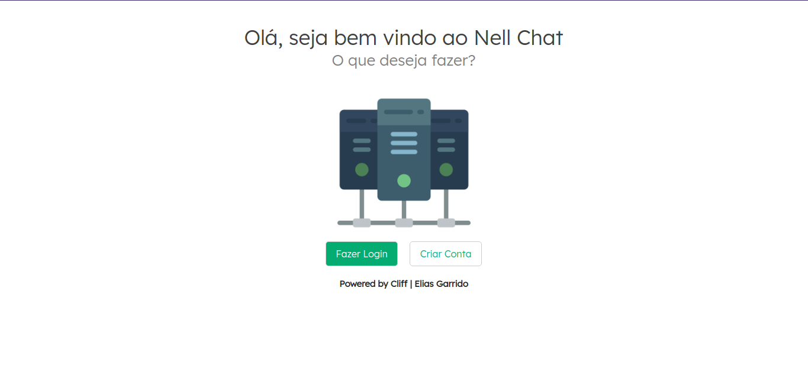

 <h2 align="center">Nell Chat</h2>
  
  
 <h4 align="center">
  

</h4>

### Instalação

#### Download
    git clone https://github.com/Mastercliff/nell-laravel-chat.git

    cd nell-laravel-chat

#### Configurar .env

> Basta criar uma cópia do arquivo .env.example, renomeá-lo para .env e gerar uma chave com o comando abaixo

#### Compilar e Preparar

> Execute os próximos comandos para instalar e compilar todas as dependências

    composer install

    npm install

    npm run dev
    
    php artisan key:generate

> Caso a chave não seja inserida automaticamente dentro do .env em APP_KEY, então gere a chave com o comando abaixo, copie a chave que aparecer e insira em APP_KEY no .env

    php artisan key:generate --show

#### Banco de dados

>  Abra o arquivo .env e adicione as informações do banco de dados depois rode o comando abaixo:

    php artisan migrate

#### Pusher

>Eu deixei as informações do meu app pusher no .env.example, mas você pode modifica-las e inserir as informações do seu app pusher caso queira.

#### Tudo Pronto

    php artisan serve